# 🚕 RideShare Bot — Full Feature Flow

> A comprehensive walkthrough of every Telegram Bot feature, user interaction flow, state machine transition, and edge case. This document covers both the **Rider** and **Driver** perspectives.

---

## Table of Contents

1. [Getting Started (`/start`)](#1-getting-started)
2. [Role Selection](#2-role-selection)
3. [Rider Flow](#3-rider-flow)
   - [Registration](#31-rider-registration)
   - [Requesting a Ride](#32-requesting-a-ride)
   - [Route Confirmation & Pricing](#33-route-confirmation--pricing)
   - [Driver Matching](#34-driver-matching)
   - [Ride Status & Cancellation](#35-ride-status--cancellation)
   - [Payment Flow](#36-payment-flow)
   - [Rating the Driver](#37-rating-the-driver)
   - [Saved Locations (Favorites)](#38-saved-locations-favorites)
   - [Wallet](#39-wallet)
4. [Driver Flow](#4-driver-flow)
   - [Registration](#41-driver-registration)
   - [Admin Approval Gate](#42-admin-approval-gate)
   - [Going Online/Offline](#43-going-onlineoffline)
   - [Receiving & Accepting a Ride](#44-receiving--accepting-a-ride)
   - [Starting & Completing a Ride](#45-starting--completing-a-ride)
   - [Earnings & Stats](#46-earnings--stats)
   - [Live Location Updates](#47-live-location-updates)
5. [AI Support Assistant](#5-ai-support-assistant)
6. [Global Commands](#6-global-commands)
7. [Multi-Language Support](#7-multi-language-support)
8. [Complete Ride Lifecycle](#8-complete-ride-lifecycle)
9. [Edge Cases & Error Handling](#9-edge-cases--error-handling)

---

## 1. Getting Started

When a user opens the bot for the first time and sends `/start`, the bot checks if they are a returning or new user.

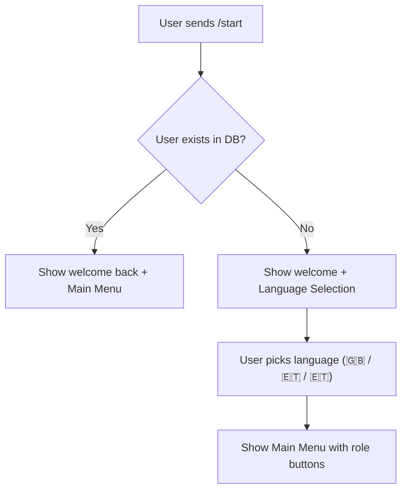

**What the user sees (first time):**
```
👋 Welcome to RideShare, Gemechu!

This is the #1 ride-hailing bot for Ethiopia. 
Get a ride in seconds, or earn money as a driver.

🌐 Please select your language:
```

**Inline buttons:** `🇬🇧 English` · `🇪🇹 Amharic` · `🇪🇹 Oromiffa`

---

## 2. Role Selection

After language selection, the user sees the **Main Menu** with role-based buttons:

| Button | Action |
|--------|--------|
| `🚖 I'm a Rider` | Enter the Rider flow |
| `🚗 I'm a Driver` | Enter the Driver registration/menu |
| `🌐 Language` | Change language preference |
| `❓ Help` | Show help text based on role |

---

## 3. Rider Flow

### 3.1 Rider Registration

First-time riders must provide a phone number before they can request rides.

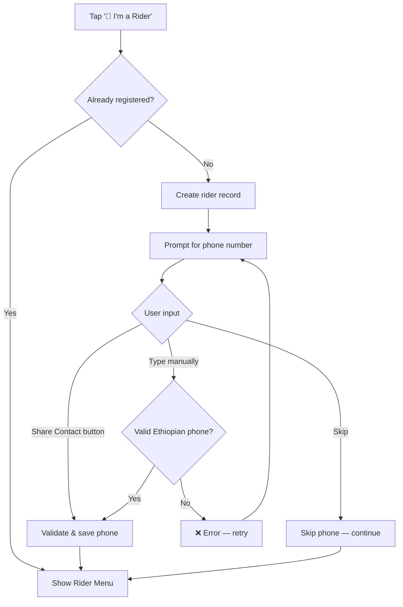

**Phone Validation Rules:**
- Must start with `+251`, `251`, `09`, or `07`
- Must be 10-13 digits
- Auto-normalized to `+251...` format

### 3.2 Requesting a Ride

This is the core feature. The rider shares their pickup and destination locations.

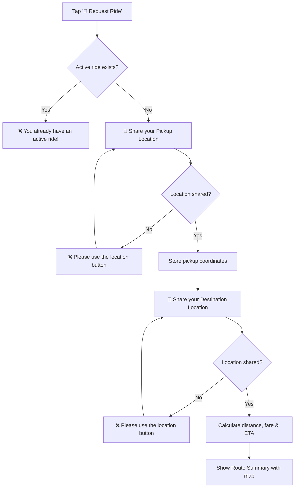

**What the user sees after sharing both locations:**
```
🗺️ Route Summary

📏 Distance: 4.2 km
⏱️ Est. Duration: 10 min
💵 Est. Fare: 184.00 ETB

Do you want to confirm this ride?
```

**Inline buttons:** `✅ Confirm Ride` · `❌ Cancel`

### 3.3 Route Confirmation & Pricing

The **Dynamic Pricing Engine** calculates fare using:

| Component | Value |
|-----------|-------|
| Base Fare | 50.00 ETB |
| Per KM Rate | 20.00 ETB/km |
| Per Minute Rate | 2.00 ETB/min |
| Minimum Fare | 100.00 ETB |
| Surge Multiplier | 1.0x — 2.0x (20% chance of surge) |

**Formula:**
```
fare = max(100, (50 + distance × 20 + duration × 2) × surge_multiplier)
```

The bot also displays a **static map image** showing the route between pickup and destination using the Google Static Maps API.

### 3.4 Driver Matching

After the rider confirms, the **Matching Engine** searches for the nearest available driver.

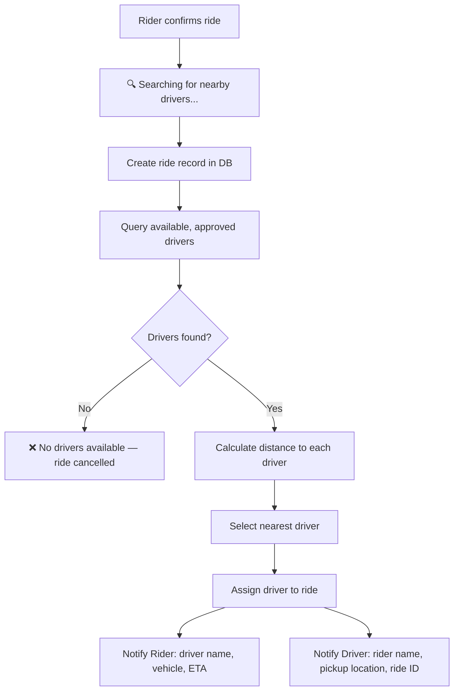

**Matching Criteria:**
1. Driver must be `APPROVED` status
2. Driver must be `available = true`
3. Sorted by GPS distance from rider's pickup point
4. Nearest driver is auto-assigned

### 3.5 Ride Status & Cancellation

**Ride Status Button:** At any point during an active ride, the rider can tap `📊 Ride Status` to see:
```
🚕 Ride Status (ID: 42)

Status: ASSIGNED
Driver: Abebe
Vehicle: Car
```

**Cancellation Flow:**

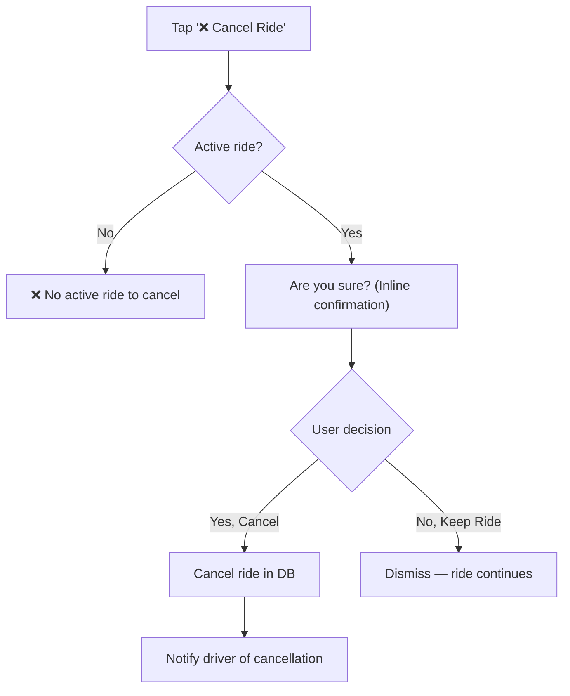

### 3.6 Payment Flow

When the driver marks the ride as complete, the ride enters `AWAITING_PAYMENT` status and the rider receives a payment prompt.

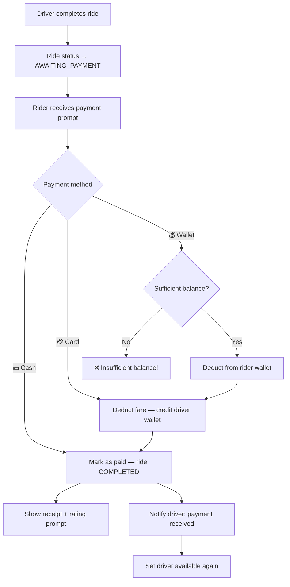

**What the rider sees:**
```
🏁 You have arrived!

💵 Total Fare: 184.00 ETB

Please select your payment method to complete the ride:
```

**Inline buttons:** `💵 Cash` · `💳 Card` · `💰 Wallet`

### 3.7 Rating the Driver

After payment, the rider is prompted to rate the driver (1-5 stars).

**Inline buttons:** `⭐ 1` · `⭐ 2` · `⭐ 3` · `⭐ 4` · `⭐ 5`

```
✅ Thank You!

You rated this ride: ⭐⭐⭐⭐⭐

Your feedback helps us improve our service!
```

The rating is saved to the database and affects the driver's average rating.

### 3.8 Saved Locations (Favorites)

Riders can save frequently used locations for quick ride requests.

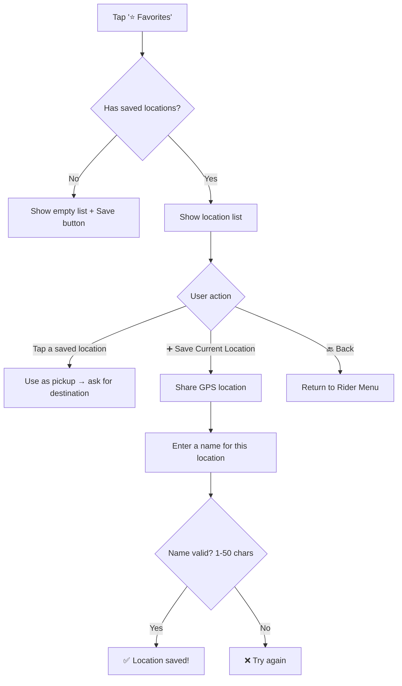

### 3.9 Wallet

Riders can check their simulated wallet balance:

```
💳 Wallet & Payments

💰 Current Balance: 500.00 ETB

(This is a simulated wallet. In a real app, you would add funds here via a payment gateway like Chapa.)
```

---

## 4. Driver Flow

### 4.1 Driver Registration

Driver registration is a multi-step onboarding conversation collecting all required information.

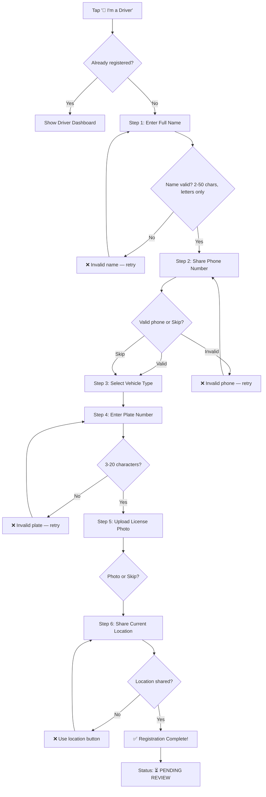

**Vehicle Type Options:**

| Button | Type |
|--------|------|
| `🚗 Car` | Standard sedan |
| `🏍 Motorcycle` | Motorbike |
| `🚐 Van` | Minivan/van |
| `🛵 Bike` | Bicycle |

### 4.2 Admin Approval Gate

New drivers are set to `PENDING` status and **cannot go online or receive rides** until an admin approves them through the Admin Dashboard.

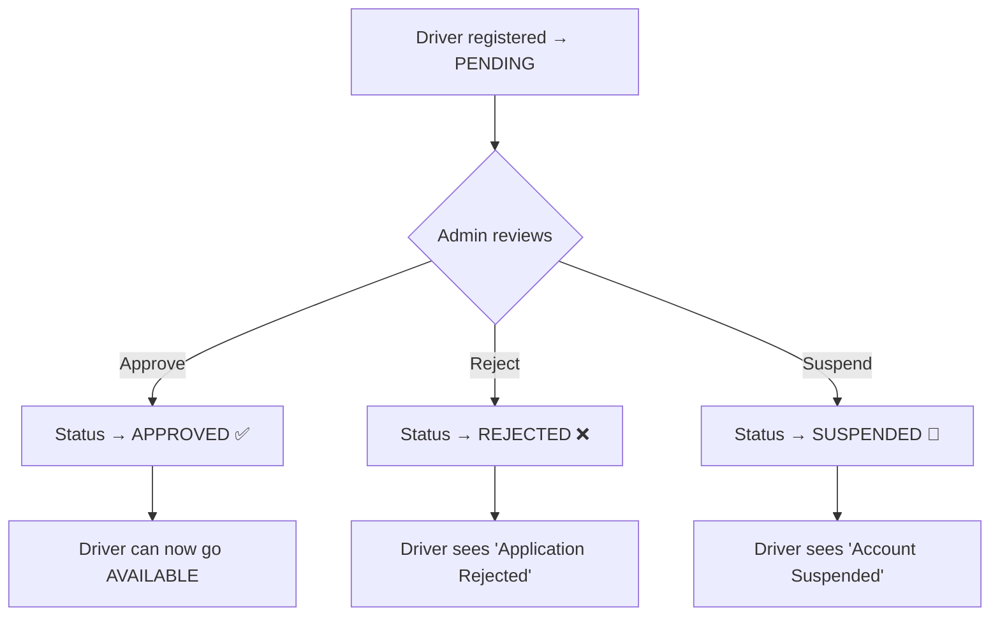

**What a PENDING driver sees when trying to go online:**
```
⏳ Your account is still pending review.
Please wait for admin approval before you can start accepting rides.
```

### 4.3 Going Online/Offline

Once approved, drivers can toggle their availability.

| Button | Action |
|--------|--------|
| `🟢 Go Available` | Start receiving ride requests |
| `🔴 Go Offline` | Stop receiving ride requests |

```
✅ Status: AVAILABLE

You will now receive nearby ride requests.
```

### 4.4 Receiving & Accepting a Ride

When a rider's request is matched to this driver, the driver receives a notification.

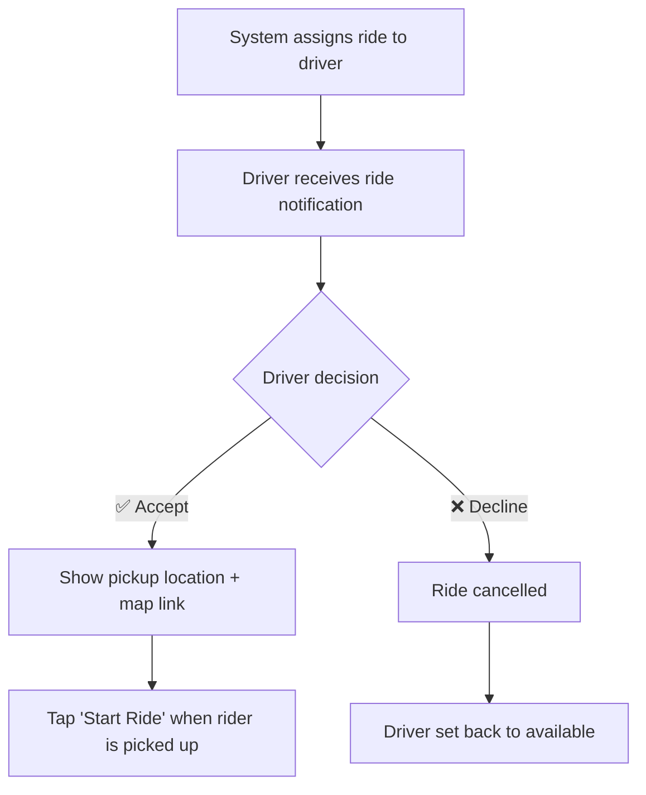

**What the driver sees:**
```
🔔 New Ride Request!

👤 Rider: Gemechu
📍 Pickup: [Google Maps Link]
📏 Distance: 1.2 km away
🆔 Ride ID: #42
```

**Inline buttons:** `✅ Accept Ride` · `❌ Decline`

After accepting:
```
✅ Accepted!

📍 View Route on Map

Tap Start Ride when the rider is picked up.
```

### 4.5 Starting & Completing a Ride

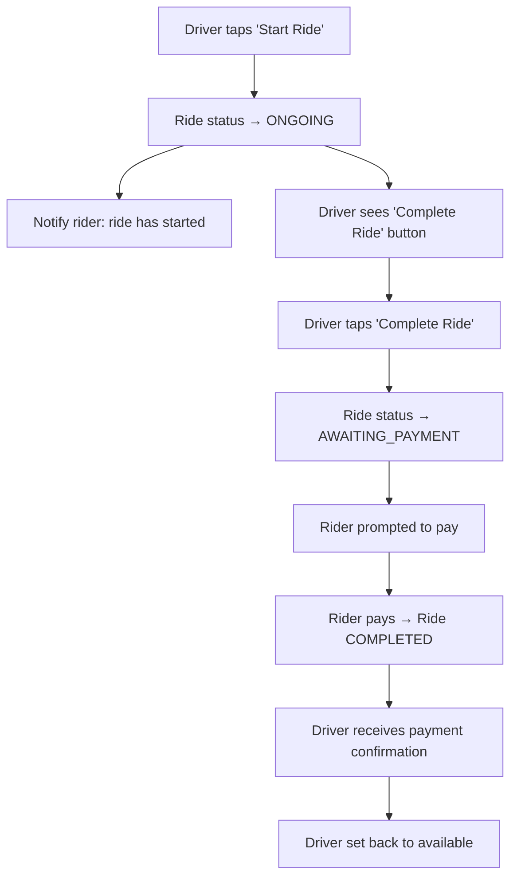

**What the driver sees while waiting for payment:**
```
⏳ Waiting for Payment...

The rider has been prompted to pay the fare.
```

### 4.6 Earnings & Stats

Drivers can view their performance metrics by tapping `📊 My Stats`:

```
📊 Driver Statistics

🗓️ Today:
  • Rides: 5
  • Earnings: 625.00 ETB

📈 All Time:
  • Total Rides: 42
  • Total Earnings: 5,250.00 ETB
  
⭐ Rating: 4.8/5.0
📅 Joined: 2026-07-15
```

### 4.7 Live Location Updates

When a driver shares their live location (or sends a one-time location), the system updates their GPS coordinates in the database. This is critical for the matching algorithm to find the nearest driver.

```
📍 Location updated successfully.
```

---

## 5. AI Support Assistant

The bot includes a **rule-based AI support assistant** accessible via the `🤖 AI Support` button or the `/support` command.

```mermaid
flowchart TD
    A["User taps '🤖 AI Support'"] --> B["Bot shows issue categories"]
    B --> C["User describes their problem"]
    C --> D["AI classifies the query"]
    D --> E{Category detected}
    E -- "driver_late" --> F["⏳ Driver Late response"]
    E -- "payment_issue" --> G["💳 Payment response + ESCALATED"]
    E -- "lost_item" --> H["📦 Lost Item response + ESCALATED"]
    E -- "safety_concern" --> I["🚨 Safety Alert + IMMEDIATE ESCALATION"]
    E -- "wrong_pickup" --> J["📍 Wrong Pickup response"]
    E -- "rider_not_responding" --> K["📵 Unresponsive Rider response"]
    E -- "general" --> L["💬 General help categories"]
    F & G & H & I & J & K & L --> M["User can describe another issue or /cancel"]
```

**AI Classification Categories:**

| Category | Keywords | Risk Level | Escalated? |
|----------|----------|------------|------------|
| `driver_late` | late, waiting, where is, delayed | 🟢 LOW | No |
| `wrong_pickup` | wrong location, different place | 🟢 LOW | No |
| `payment_issue` | payment, charge, refund, overcharged | 🟡 MEDIUM | ✅ Yes |
| `lost_item` | lost, forgot, left, phone, bag | 🟡 MEDIUM | ✅ Yes |
| `safety_concern` | unsafe, dangerous, accident, emergency | 🔴 HIGH | ✅ Yes |
| `rider_not_responding` | no response, can't reach, rider gone | 🟢 LOW | No |
| `general` | (no match) | 🟢 LOW | No |

**Example interaction:**
```
User: I left my phone in the car

Bot: 📦 Lost Item Report
     We'll help you recover your item:
     1️⃣ Your report has been logged.
     2️⃣ The driver from your last ride will be notified.
     3️⃣ If found, we'll coordinate the return.
     
     ⚠️ This issue has been escalated to the admin team.
```

---

## 6. Global Commands

These commands work from anywhere in the bot:

| Command | Description |
|---------|-------------|
| `/start` | Restart the bot / show main menu |
| `/help` | Show help text (context-aware for rider/driver/admin) |
| `/profile` | Show your profile details |
| `/cancel` | Cancel any active operation or ride |
| `/support` | Open the AI Support assistant |

---

## 7. Multi-Language Support

The bot supports three languages:

| Language | Code | Flag |
|----------|------|------|
| English | `en` | 🇬🇧 |
| Amharic (አማርኛ) | `am` | 🇪🇹 |
| Oromiffa (Afaan Oromoo) | `om` | 🇪🇹 |

All button labels, prompts, and error messages are dynamically translated. Users can change language at any time via the `🌐 Language` button.

---

## 8. Complete Ride Lifecycle

This diagram shows the full lifecycle of a ride from start to finish:

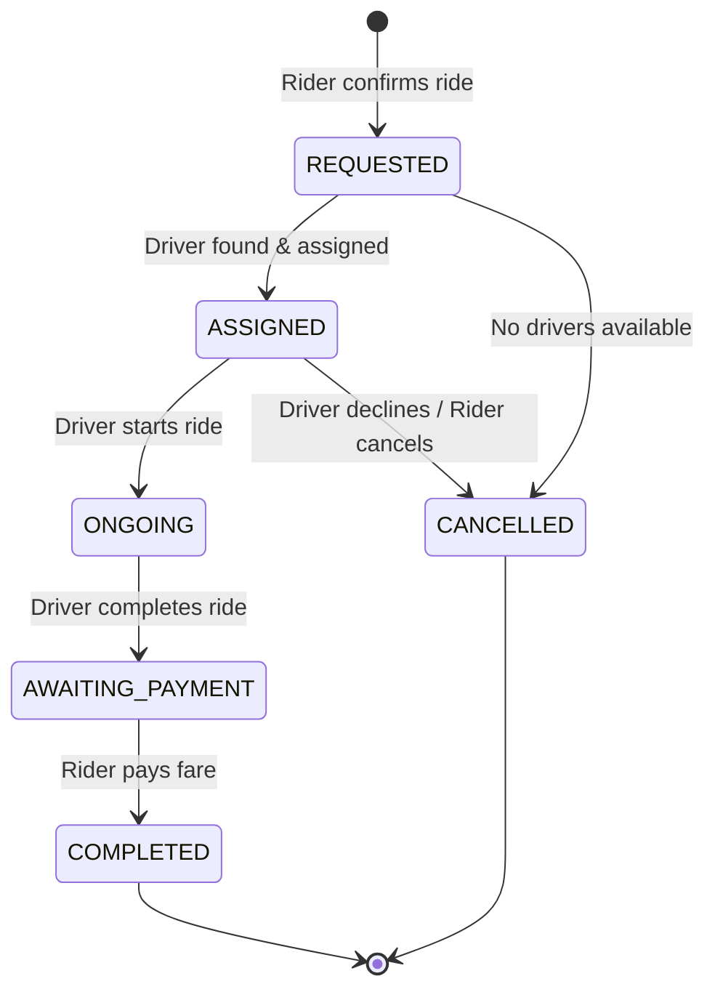

**Ride Status Transitions:**

| From | To | Triggered By |
|------|----|--------------|
| — | `REQUESTED` | Rider confirms route |
| `REQUESTED` | `ASSIGNED` | Matching engine finds driver |
| `REQUESTED` | `CANCELLED` | No drivers / rider cancels |
| `ASSIGNED` | `ONGOING` | Driver taps "Start Ride" |
| `ASSIGNED` | `CANCELLED` | Driver declines / Rider cancels |
| `ONGOING` | `AWAITING_PAYMENT` | Driver taps "Complete Ride" |
| `AWAITING_PAYMENT` | `COMPLETED` | Rider selects payment method |

---

## 9. Edge Cases & Error Handling

### Rider Edge Cases

| Scenario | Bot Response |
|----------|-------------|
| Rider requests a ride while having an active one | `❌ You already have an active ride (ID: 42)!` |
| Rider sends text instead of location | `❌ Please use the button below to share your location.` |
| Session expires (pickup data lost) | `❌ Session expired. Please request a ride again.` |
| No drivers available | `❌ No drivers available nearby. Please try again later.` |
| Rider tries to pay with insufficient wallet balance | `❌ Insufficient wallet balance!` (popup alert) |
| Payment on an already-processed ride | `❌ This payment is no longer valid or already processed.` |
| Cancelling with no active ride | `❌ No active ride to cancel.` |
| Saved location name too long (>50 chars) | `❌ Name must be between 1 and 50 characters.` |
| Using a saved location that no longer exists | `❌ Location not found.` |

### Driver Edge Cases

| Scenario | Bot Response |
|----------|-------------|
| PENDING driver tries to go online | `⏳ Your account is pending review.` |
| SUSPENDED driver tries to go online | `🚫 Your account is suspended.` |
| Driver tries to accept an expired/cancelled ride | `❌ This ride is no longer available.` |
| Driver tries to start a non-ASSIGNED ride | `❌ This ride cannot be started.` |
| Driver tries to complete a non-ONGOING ride | `❌ This ride cannot be completed.` |
| Invalid vehicle type during registration | `❌ Select from buttons:` |
| Invalid plate number (< 3 chars) | `❌ Invalid plate number. Please try again:` |
| License upload: neither photo nor skip | `❌ Please send a photo of your license.` |
| Location not shared via button | `❌ Use the button to share location:` |

### General Edge Cases

| Scenario | Bot Response |
|----------|-------------|
| Unregistered user tries `/profile` | `Profile not found. Please register first.` |
| `/cancel` with no active ride | `No active operation to cancel.` |
| Invalid phone number format | `❌ Invalid phone number. Must start with +251, 09, or 07.` |

---

## Architecture Notes

### State Machine (FSM)

The bot uses `ConversationHandler` from `python-telegram-bot` to manage multi-step flows. Key states:

**Rider States:**
- `RIDER_REGISTERING_PHONE` — Waiting for phone input
- `WAITING_LOCATION` — Waiting for pickup GPS
- `RIDER_WAITING_DESTINATION` — Waiting for destination GPS
- `RIDER_CONFIRMING_ROUTE` — Showing route summary, waiting for confirm/cancel
- `RIDER_MANAGING_FAVORITES` — In the favorites menu
- `RIDER_SAVING_LOCATION_NAME` — Naming a saved location

**Driver States:**
- `DRIVER_REGISTERING_NAME` → `DRIVER_REGISTERING_PHONE` → `DRIVER_REGISTERING_VEHICLE` → `DRIVER_REGISTERING_PLATE` → `DRIVER_UPLOADING_LICENSE` → `DRIVER_REGISTERING_LOCATION`

### Key Services

| Service | Purpose |
|---------|---------|
| `services/pricing.py` | Fare calculation with surge pricing |
| `services/matching.py` | Nearest-driver matching algorithm |
| `services/ai_support.py` | AI support classification, demand forecasting, driver insights |
| `services/notifications.py` | Push notifications to riders and drivers |
| `services/location.py` | GPS distance calculation, Google Maps integration |

---

> **💡 Tip for Demo:** To fully test the ride lifecycle, you need two Telegram accounts — one as a Rider and one as a Driver. Register the driver first, approve them via the Admin Dashboard at `http://localhost:3000`, then request a ride as the rider.
